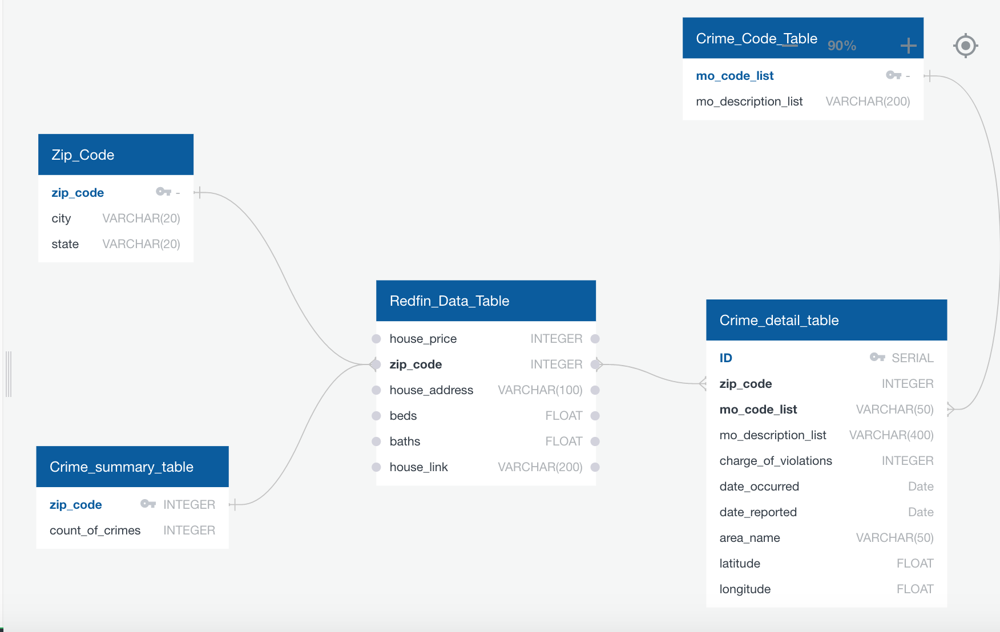

# ETL Project Transformative Owls

## Objective:
Gather data sources, transform and load into a database.  The data involves housing information from Redfin and crime information for the Los Angeles County.  We are going to see how housing information and how safe the houses are in each area. 

## Libraries:
* Pandas
* numpy
* sodapy
* socratica
* datetime
* citipy
* SearchEngine uszipcode 
* pprint
* BeautifulSoup
* Splinter

## Data Sources:
* Redfin Data (Scrape from redfin website)
* Crime Rate Data API (https://dev.socrata.com/docs/endpoints.html, https://data.lacity.org/A-Safe-City/Crime-Data-from-2010-to-2019/63jg-8b9z ) 

## Project Report

* **E**xtract:
  * **Redfin** 
        The housing information was taken from Redfin website, we directly scrape housing information which is displayed on the website. 

  * **Crime Data** 
        The crime information was taken from data.lacity.org, the format that they use is socrata. The socrata data platform enables governments to use data as a strategic asset in the design, management, and delivery of programs.  I also had to use sodapy, this library supports writing directly to datasets with the Socrata Open Data API. An API token was extracted from the socrata site in order to read into a Jupyter Lab notebook.

* **T**ransform:
  * **Redfin**
        After we scraped the data from Redfin, we separate the dataframe into two small datastes (**Redfin data table** and **Zip_code table**) and export into csv files

  * **Crime Data** 
    * Then a function was made to share the city name by the package citipy by using the latitude and longitude. 
    * The zipcodes were added through a package called SearchEngine with uszipcode. They were added with a function. 
    * The column information was renamed for legibility purposes and to change from the abbreviations.   
    * The time stamp was changed to a date with the datetime package. 
    * Instead of using the crime codes that were vague we used the Modus Operandi codes instead.  There are multiple codes for one crime code violation, so that was a challenge.  
    * We created a function to pull the mo_code description into a dictionary type. 
    * More renaming of the columns happened to fit into a ERD table. 
    * Then data frames were made and saved into CSV files (Crime Code Table, Crime Detail Table, and Crime, Summary Table).

* **L**oad: the final database, tables/collections, and why this was chosen.
  * Create ERD for different table. 
  * Create schema and tables in Postgresql.
  * Upload csv file into postgresql.

## ERD

